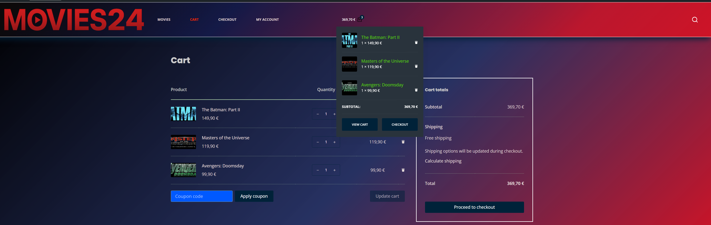
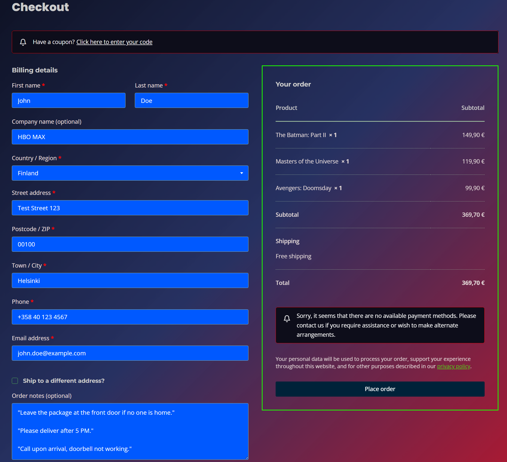
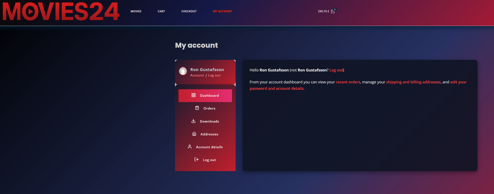

# 🎓 WordPress & WooCommerce Training

## 📖 Introduction

This project was part of my studies, and the goal was to learn how to use **WordPress** and **WooCommerce**. I built several test sites to practice the basics of e-commerce and to get familiar with the tools commonly used in website and online store development. I could have kept refining the sites endlessly, but I also need to move forward with my studies.
(*Some of these sites are connected to my own business ideas, so I cannot share further details about them here.*)

I also have a personal interest in **developing streaming services**, and I’ve always tried to hit two birds with one stone in my studies – that’s why the theme of my online store was selling movies. I’ve been passionate about films and TV series for decades, and one of my future dreams is to help build **streaming applications** that are attractive to viewers, user-friendly, and stand out in a highly competitive market. I already have plenty of ideas and innovations in mind…

---

## 🎯 Goals

- Understand the basics of WordPress as a content management system.  
- Install and set up WooCommerce to build a functional online store.  
- Practice using and customizing themes and plugins.  
- Develop an understanding of website optimization, usability, and search engine visibility.  

---

## ❓ Why WP & WooCommerce?

**WordPress** is the world’s most popular content management system, capable of creating almost any type of website. **WooCommerce** extends WordPress into a full-featured online store and provides extensive options for product management, payments, and deliveries. Together, they form an excellent way to learn website and e-commerce development, as both are widely used and well-documented.  

---

## 🛠️ How I Did It

- **LocalWP**: Set up the development environment and launched the sites.  
- **WordPress (WP)**: Basic installation, configuration, and building the site structure.  
- **WooCommerce**: Installed the plugin, configured the settings, and added the store with products.  
- **Blocksy**: A popular and flexible base theme, which I customized by building the site structure, layout, and color palette all by hand. 
- **Elementor**: A page builder used to create more visually appealing blocks and pages.  
- **All-in-One WP Migration and Backup**: A tool for backing up and transferring the site.  
- **Yoast SEO**: A plugin for practicing the basics of search engine optimization.   

---

🖼️ Two images per row for better viewing experience in mobile.  

<table>
  <tr>
    <td align="center">
       
      <strong>Movies24 Site frontpage </strong> 
      <a href="frontpage.png">🔍 View full size</a>
    </td>
    <td align="center">
       
      <strong>Movies24 Site cart</strong> 
      <a href="cart.png">🔍 View full size</a>
    </td>
  </tr>

  <tr>
    <td align="center">
       
      <strong>Movies24 Site checkout </strong> 
      <a href="checkout.png">🔍 View full size</a>
    </td>
    <td align="center">
       
      <strong>Movies Site my account</strong> 
      <a href="my_account.png">🔍 View full size</a>
    </td>
  </tr>

  <tr>
    <td align="center">
       
      <strong>Avatar - The Fire and Ash</strong> 
      <a href="Avatar - The Fire and Ash.png">🔍 View full size</a>
    </td>
    <td align="center">
       
      <strong>Star Wars - The Mandalorian and Grogu</strong> 
      <a href="Star Wars - The Mandalorian and Grogu.png">🔍 View full size</a>
    </td>
  </tr>

  <tr>
    <td align="center">
       
      <strong>Avengers - Doomsday</strong> 
      <a href="Avengers - Doomsday.png">🔍 View full size</a>
    </td>
    <td align="center">
       
      <strong>Avengers - Secret Wars</strong> 
      <a href="Avengers - Secret Wars.png">🔍 View full size</a>
    </td>
  </tr>

  <tr>
    <td align="center">
       
      <strong>28 Years Later - The Bone Temple</strong> 
      <a href="28 Years Later - The Bone Temple.png">🔍 View full size</a>
    </td>
    <td align="center">
       
      <strong>The Odyssey</strong> 
      <a href="The Odyssey.png">🔍 View full size</a>
    </td>
  </tr>

  <tr>
    <td align="center">
       
      <strong>Masters of The Universe</strong> 
      <a href="Masters of The Universe.png">🔍 View full size</a>
    </td>
    <td align="center">
       
      <strong>The Batman Part 2</strong> 
      <a href="The Batman Part 2.png">🔍 View full size</a>
    </td>
  </tr>
</table>

🔙 [Back to Profile](https://github.com/Ron-Gustafsson)
